# Documentación Técnica — Lab NDR: Suricata + Zeek + Grafana/Loki


---

## Índice

1. [Creación de la máquina virtual en Proxmox](#1-creación-de-la-máquina-virtual-en-proxmox)
   - 1.1 [General — nombre e ID de VM](#11-general--nombre-e-id-de-vm)
   - 1.2 [SO — imagen ISO y sistema operativo](#12-so--imagen-iso-y-sistema-operativo)
   - 1.3 [Sistema — controlador y firmware](#13-sistema--controlador-y-firmware)
   - 1.4 [Discos — tamaño y formato](#14-discos--tamaño-y-formato)
   - 1.5 [CPU — núcleos y tipo de procesador](#15-cpu--núcleos-y-tipo-de-procesador)
   - 1.6 [Memoria — RAM asignada](#16-memoria--ram-asignada)
   - 1.7 [Red — primera interfaz de red](#17-red--primera-interfaz-de-red)
   - 1.8 [Confirmación final de la VM](#18-confirmación-final-de-la-vm)
   - 1.9 [Agregar interfaz de captura](#19-agregar-interfaz-de-captura)

2. [Instalación de Ubuntu Server 24.04](#2-instalación-de-ubuntu-server-2404)
   - 2.1 [Selección de idioma](#21-selección-de-idioma)
   - 2.2 [Configuración de almacenamiento](#22-configuración-de-almacenamiento)
   - 2.3 [Configuración de perfil de usuario](#23-configuración-de-perfil-de-usuario)
   - 2.4 [Configuración de SSH](#24-configuración-de-ssh)
   - 2.5 [Progreso de instalación](#25-progreso-de-instalación)

3. [Configuración de red y modo promiscuo](#3-configuración-de-red-y-modo-promiscuo)
   - 3.1 [Agregar segunda NIC de captura en Proxmox](#31-agregar-segunda-nic-de-captura-en-proxmox)
   - 3.2 [Configuración de red con Netplan](#32-configuración-de-red-con-netplan)
   - 3.3 [Aplicación de Netplan y verificación](#33-aplicación-de-netplan-y-verificación)
   - 3.4 [Estado completo de interfaces de red](#34-estado-completo-de-interfaces-de-red)
   - 3.5 [Activar modo promiscuo en ens20](#35-activar-modo-promiscuo-en-ens20)
   - 3.6 [Servicio systemd para persistencia del modo promiscuo](#36-servicio-systemd-para-persistencia-del-modo-promiscuo)
   - 3.7 [Confirmación del servicio promiscuo activo](#37-confirmación-del-servicio-promiscuo-activo)

4. [Instalación y configuración de Suricata](#4-instalación-y-configuración-de-suricata)
   - 4.1 [Añadir repositorio oficial OISF](#41-añadir-repositorio-oficial-oisf)
   - 4.2 [Instalación del paquete Suricata](#42-instalación-del-paquete-suricata)
   - 4.3 [Verificación de versión instalada](#43-verificación-de-versión-instalada)
   - 4.4 [Configuración de HOME_NET](#44-configuración-de-home_net)
   - 4.5 [Configuración de interfaz af-packet](#45-configuración-de-interfaz-af-packet)
   - 4.6 [Descarga de reglas Emerging Threats](#46-descarga-de-reglas-emerging-threats)
   - 4.7 [Revisión y test de configuración](#47-revisión-y-test-de-configuración)
   - 4.8 [Estado del servicio Suricata](#48-estado-del-servicio-suricata)
   - 4.9 [Verificación de logs eve.json](#49-verificación-de-logs-evejson)

5. [Despliegue de Zeek con Docker](#5-despliegue-de-zeek-con-docker)
   - 5.1 [Instalación de Docker](#51-instalación-de-docker)
   - 5.2 [Docker habilitado y en ejecución](#52-docker-habilitado-y-en-ejecución)
   - 5.3 [Comando de lanzamiento del contenedor Zeek](#53-comando-de-lanzamiento-del-contenedor-zeek)
   - 5.4 [Verificación del contenedor y escucha en ens20](#54-verificación-del-contenedor-y-escucha-en-ens20)
   - 5.5 [Logs de conexiones capturadas](#55-logs-de-conexiones-capturadas)
   - 5.6 [Filtrado de tráfico local](#56-filtrado-de-tráfico-local)

6. [Stack de visualización: Grafana + Loki + Promtail](#6-stack-de-visualización-grafana--loki--promtail)
   - 6.1 [Contenido del docker-compose.yml](#61-contenido-del-docker-composeyml)
   - 6.2 [Configuración de Promtail](#62-configuración-de-promtail)
   - 6.3 [Descarga e inicio del stack](#63-descarga-e-inicio-del-stack)
   - 6.4 [Servicios corriendo](#64-servicios-corriendo)
   - 6.5 [Interfaz de conexiones en Grafana](#65-interfaz-de-conexiones-en-grafana)
   - 6.6 [Configuración de la fuente de datos Loki](#66-configuración-de-la-fuente-de-datos-loki)
   - 6.7 [Pantalla de creación de dashboards](#67-pantalla-de-creación-de-dashboards)
   - 6.8 [Página de inicio de Grafana](#68-página-de-inicio-de-grafana)
   - 6.9 [Editor de panel — query de logs Suricata](#69-editor-de-panel--query-de-logs-suricata)
   - 6.10 [Panel con logs de Suricata en tiempo real](#610-panel-con-logs-de-suricata-en-tiempo-real)
   - 6.11 [Editor de panel — query de logs Zeek](#611-editor-de-panel--query-de-logs-zeek)

---

## 1. Creación de la máquina virtual en Proxmox

### 1.1 General — nombre e ID de VM

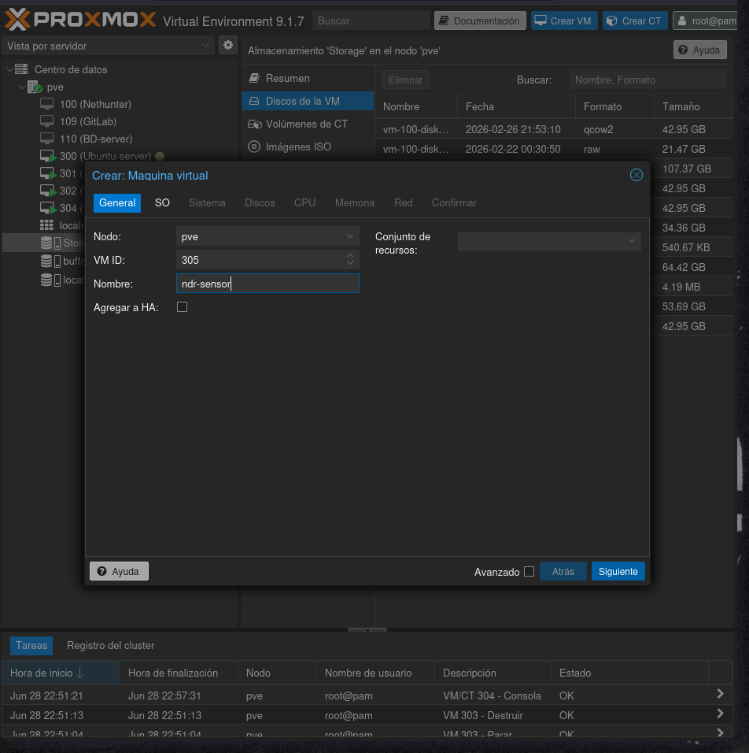

En el asistente de creación de Proxmox VE 9.1.7 se asigna el **VM ID 305** y el nombre **ndr-sensor**. El nodo de destino es `pve`. En el panel lateral izquierdo se puede ver el inventario de VMs del clúster, entre ellas `300 (Ubuntu-server)`, `301 (Pfsense-firewall)`, `302 (WS-AD)` y `304 (wazuh)`, lo que confirma que esta VM se integra en un entorno de laboratorio de ciberseguridad más amplio. El campo "Conjunto de recursos" queda vacío al no usarse Resource Pools.

---

### 1.2 SO — imagen ISO y sistema operativo

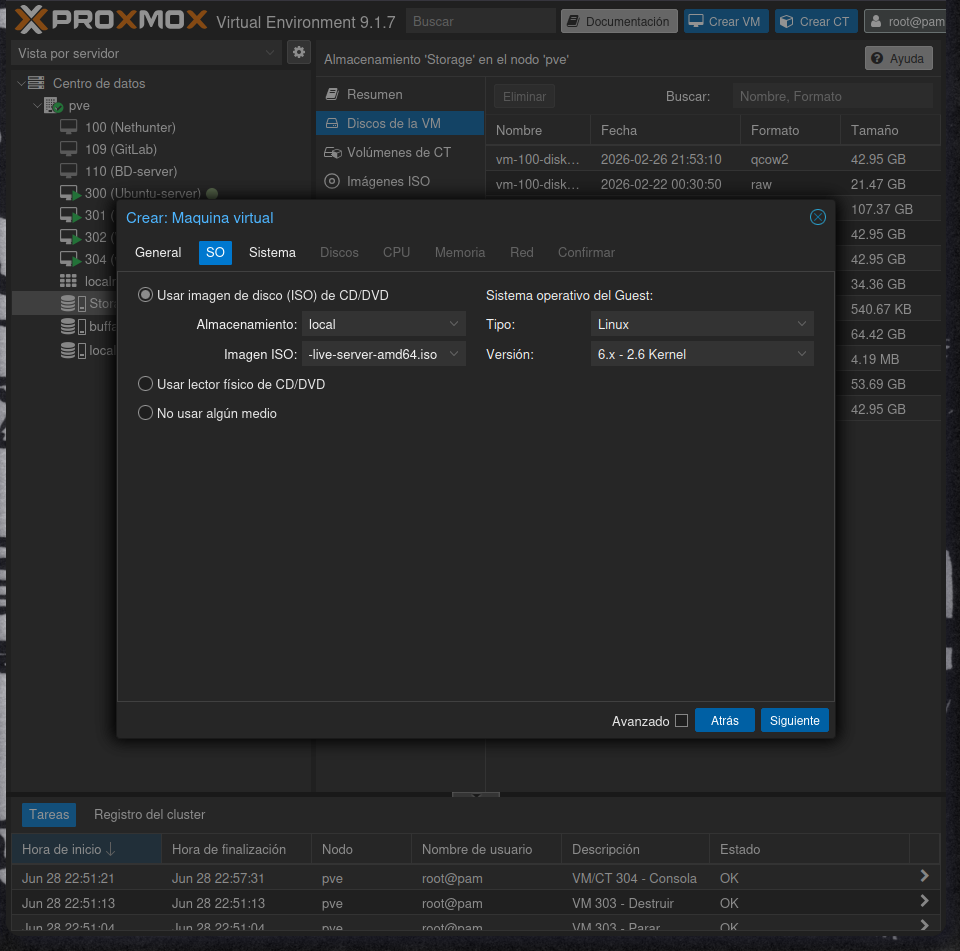

Se selecciona la imagen **ubuntu-24.04.4-live-server-amd64.iso** almacenada en el almacenamiento local del nodo. El tipo de SO se configura como **Linux** con versión de kernel **6.x - 2.6 Kernel**, que es la opción correcta para Ubuntu 24.04 LTS. No se utiliza lector de CD/DVD físico, sino la ISO montada como dispositivo IDE2.

---

### 1.3 Sistema — controlador y firmware

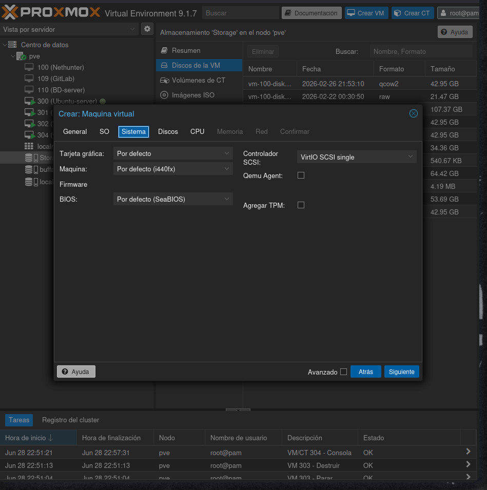

Se configura:
- **Controlador SCSI**: VirtIO SCSI single — ofrece el mejor rendimiento de disco en entornos KVM/QEMU al usar el driver paravirtualizado de VirtIO.
- **Máquina**: Por defecto (i440fx) — chipset estable y ampliamente compatible con Linux.
- **BIOS**: Por defecto (SeaBIOS) — firmware estándar, sin necesidad de UEFI para esta VM.
- **Qemu Agent** y **TPM** se dejan desactivados, lo que es adecuado para un servidor NDR sin requisitos de seguridad de arranque medido.

---

### 1.4 Discos — tamaño y formato

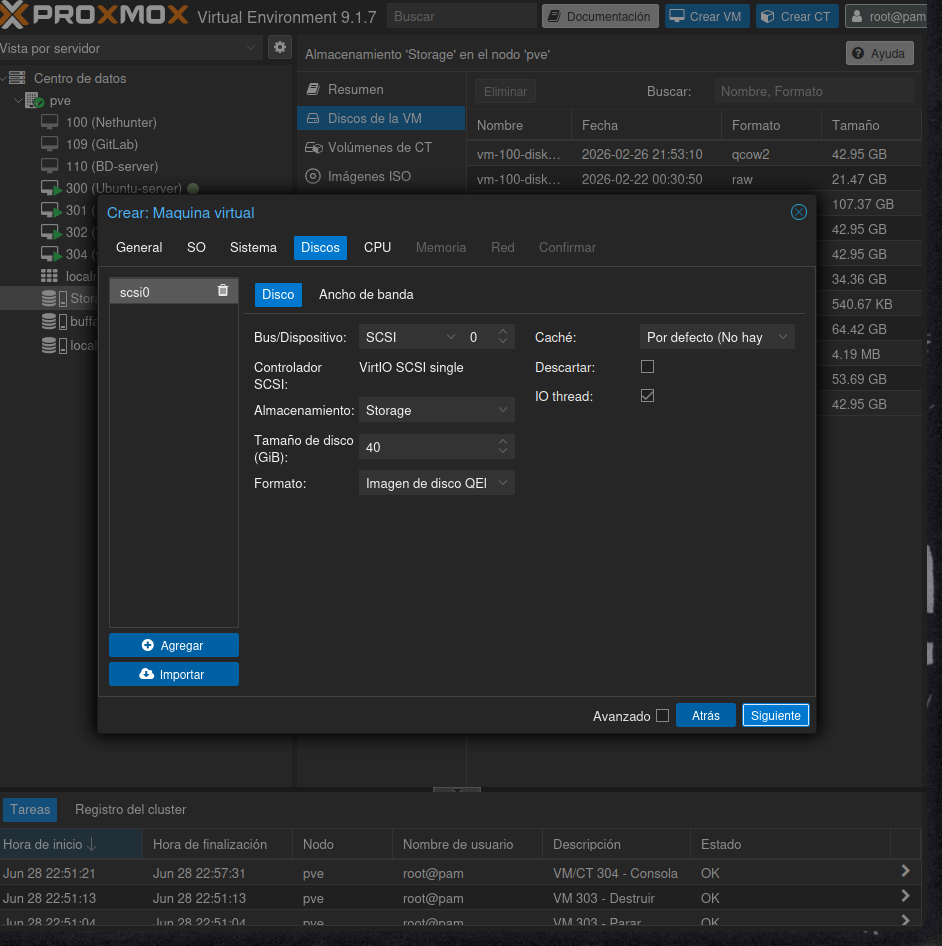

Se asigna un único disco en el bus **SCSI0** con las siguientes características:
- **Controlador SCSI**: VirtIO SCSI single
- **Almacenamiento**: pool `Storage`
- **Tamaño**: 40 GB — suficiente para el SO, Suricata, Docker y los volúmenes de logs
- **Formato**: Imagen de disco QEMU (qcow2) — permite snapshots y thin provisioning
- **IO Thread**: activado — mejora el rendimiento de I/O al dedicar un hilo exclusivo al disco
- **Caché**: Por defecto (No hay) — comportamiento seguro sin pérdida de datos ante fallos

---

### 1.5 CPU — núcleos y tipo de procesador

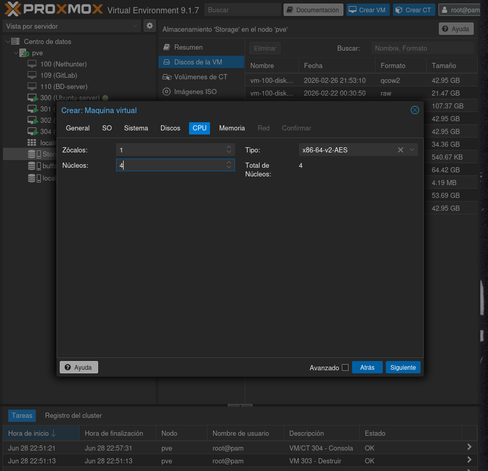

La CPU se configura con:
- **Zócalos**: 1 socket físico simulado
- **Núcleos**: 4 cores — necesarios para el rendimiento multihilo de Suricata (que escala por núcleo con af-packet)
- **Tipo**: x86-64-v2-AES — incluye soporte nativo de AES-NI y las extensiones del nivel v2 del ISA x86-64, optimizando el procesamiento de tráfico TLS/SSL cifrado que Suricata debe inspeccionar

**Total de núcleos**: 4 (1 socket × 4 cores)

---

### 1.6 Memoria — RAM asignada

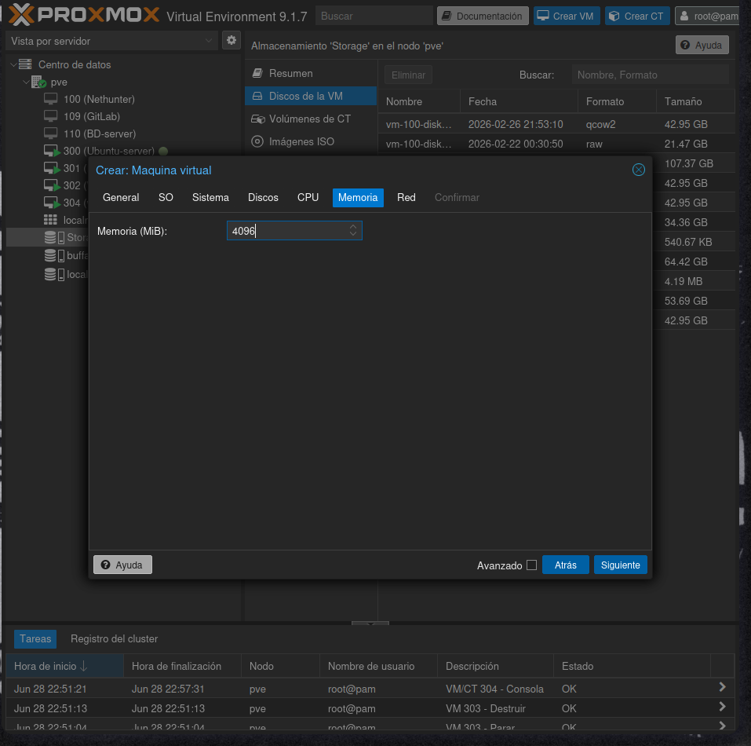

Se asignan **4096 MiB (4 GB)** de memoria RAM. Esta cantidad es suficiente para ejecutar simultáneamente:
- Ubuntu Server 24.04 (sistema base)
- Suricata 8.0.5 con 50.000+ reglas cargadas (~213 MB según el status)
- Zeek en contenedor Docker
- Stack NDR (Grafana + Loki + Promtail) en Docker Compose

No se activa el ballooning de memoria, lo que garantiza que los 4 GB están siempre reservados para esta VM.

---

### 1.7 Red — primera interfaz de red

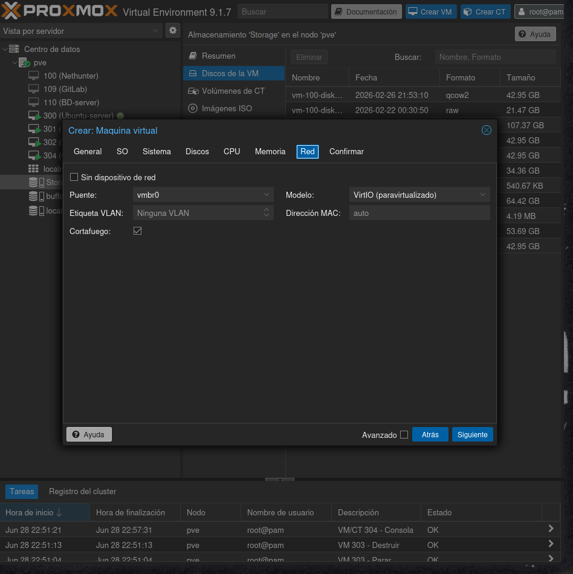

La primera interfaz de red se configura con:
- **Puente**: vmbr0 — bridge de gestión/LAN principal del hipervisor
- **Modelo**: VirtIO (paravirtualizado) — driver de red de máximo rendimiento en KVM
- **Etiqueta VLAN**: Ninguna — tráfico sin segmentación VLAN en este bridge
- **Cortafuego**: desactivado — la inspección de tráfico la realiza Suricata, no el firewall de Proxmox

Esta interfaz se corresponde con `ens18` dentro de Ubuntu y recibirá su IP por DHCP (192.168.1.228/24). Es la interfaz de administración del sensor.

---

### 1.8 Confirmación final de la VM

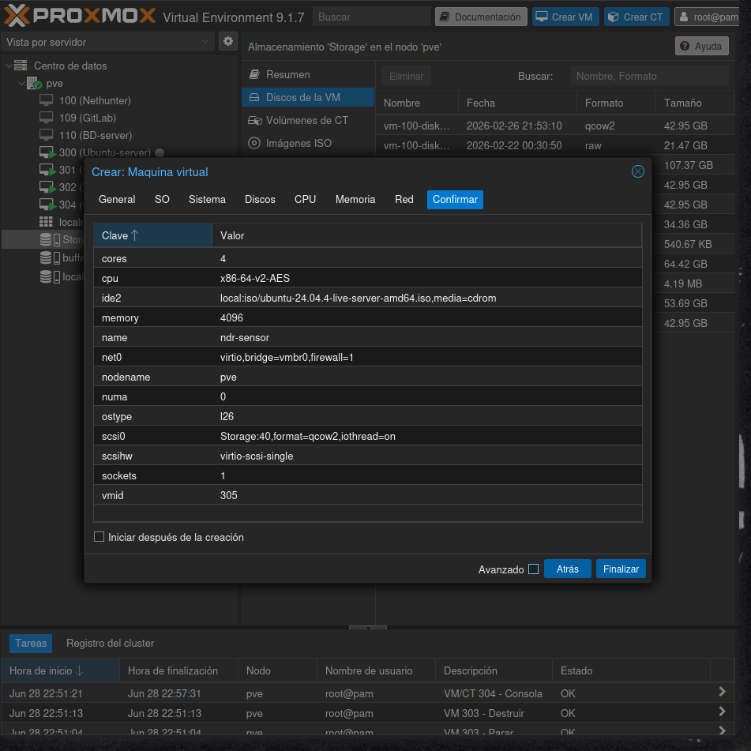

Pantalla de resumen final antes de crear la VM. Se puede ver la configuración completa en formato clave-valor:

| Clave    | Valor                                                        |
|----------|--------------------------------------------------------------|
| cores    | 4                                                            |
| cpu      | x86-64-v2-AES                                               |
| ide2     | local:iso/ubuntu-24.04.4-live-server-amd64.iso,media=cdrom  |
| memory   | 4096                                                         |
| name     | ndr-sensor                                                   |
| net0     | virtio, bridge=vmbr0, firewall=1                            |
| numa     | 0                                                            |
| ostype   | l26                                                          |
| scsi0    | Storage:40, format=qcow2, iothread=on                       |
| scsihw   | virtio-scsi-single                                          |
| sockets  | 1                                                            |
| vmid     | 305                                                          |

La opción **"Iniciar después de la creación"** está desmarcada, lo que permite agregar interfaces de red adicionales antes del primer arranque.

---

### 1.9 Agregar interfaz de captura

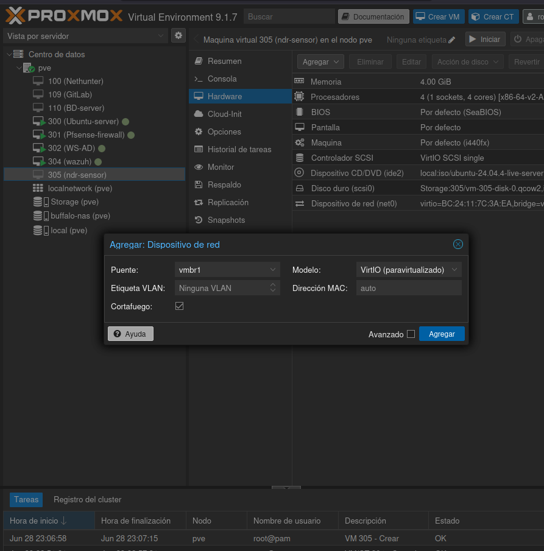

Una vez creada la VM, desde el menú **Hardware → Agregar → Dispositivo de red** se añade la segunda NIC:
- **Puente**: vmbr1 — bridge de la red interna de monitorización (192.168.100.0/24)
- **Modelo**: VirtIO (paravirtualizado)
- **Cortafuego**: activado

Esta operación se repite para agregar una tercera NIC (también en vmbr1) que será la interfaz de captura `ens20` en modo promiscuo, sin IP asignada. Tener dos NICs en el mismo bridge pero con roles distintos (ens19 con IP para comunicación y ens20 sin IP solo para captura) es una práctica habitual en sensores NDR para evitar que el tráfico de gestión contamine las capturas.

---

## 2. Instalación de Ubuntu Server 24.04

### 2.1 Selección de idioma

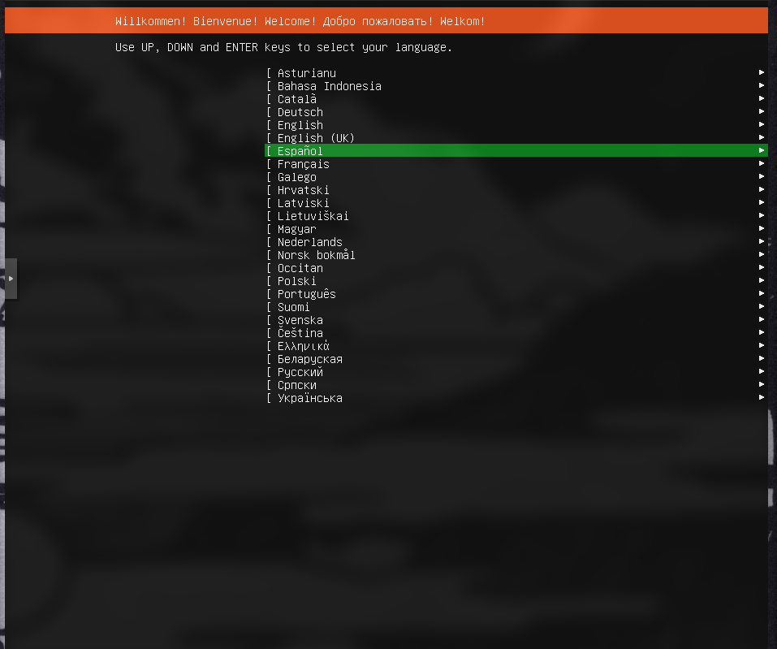

Primera pantalla del instalador Subiquity de Ubuntu 24.04.4 LTS. Se selecciona **Español** como idioma del sistema. Esta elección afecta al idioma de los mensajes del instalador y del sistema base, pero no tiene impacto en el funcionamiento de Suricata ni Zeek, que usan configuraciones en inglés de forma independiente al locale del sistema.

---

### 2.2 Configuración de almacenamiento

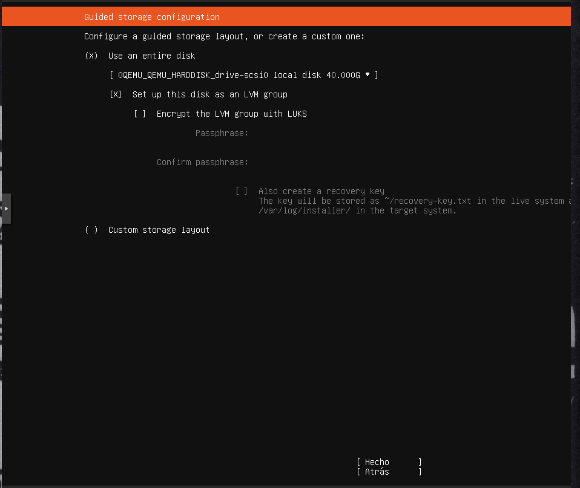

Se elige la opción **"Usar un disco completo"** sobre el dispositivo `QEMU_QEMU_HARDDISK_drive-scsi0` de 40 GB, que corresponde al disco qcow2 creado en Proxmox.

Opciones seleccionadas:
- **Configurar este disco como un grupo LVM** (activado) — permite redimensionar volúmenes lógicos en el futuro sin reparticionado
- **Cifrar el grupo LVM con LUKS** (desactivado) — no se cifra el disco ya que el sensor opera en un entorno de laboratorio controlado y el cifrado añadiría overhead en I/O de logs

El esquema LVM resultante crea automáticamente las particiones de arranque y el volumen raíz.

---

### 2.3 Configuración de perfil de usuario

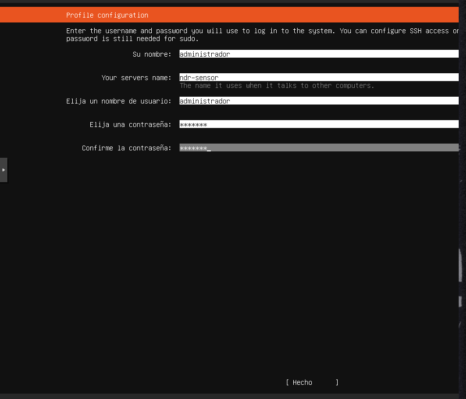

Se configura el perfil del sistema:

| Campo               | Valor         |
|---------------------|---------------|
| Su nombre           | administrador |
| Nombre del servidor | ndr-sensor    |
| Usuario             | administrador |
| Contraseña          | (oculta)      |

El hostname **ndr-sensor** identifica claramente el rol de la máquina como sensor de detección de red. Este nombre aparecerá en el prompt de la terminal (`administrador@ndr-sensor:~$`) y en los logs del sistema, facilitando la correlación de eventos.

---

### 2.4 Configuración de SSH

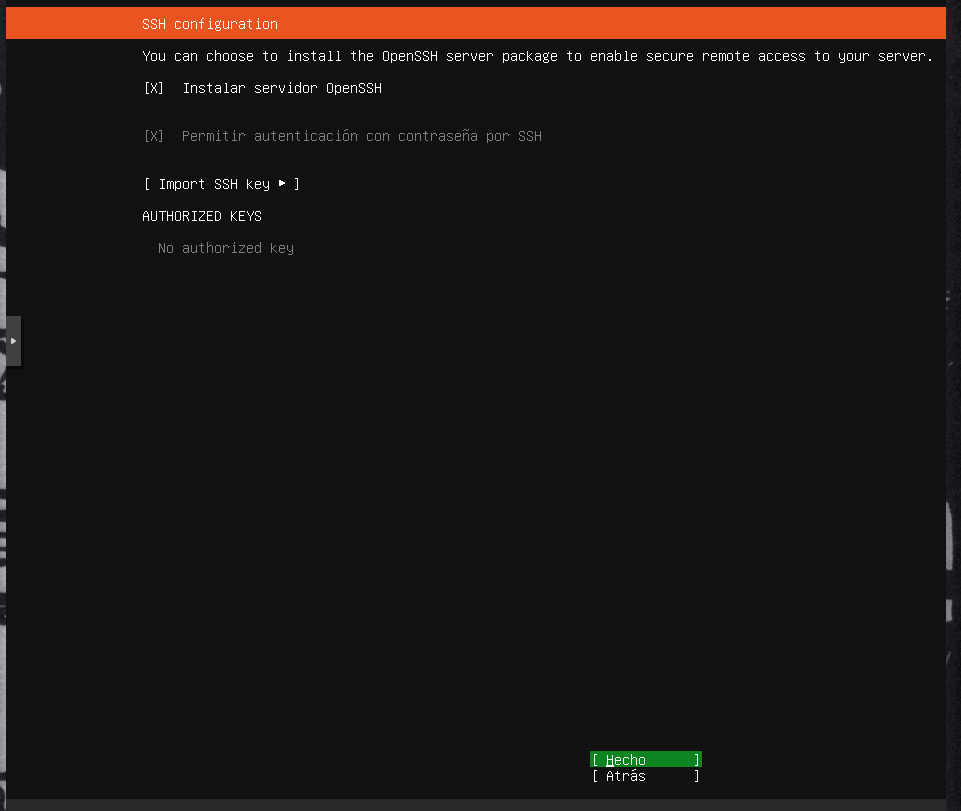

Se instala el servidor **OpenSSH** durante la instalación para permitir acceso remoto al sensor sin necesidad de consola física o virtual de Proxmox. La configuración elegida:

- **Instalar servidor OpenSSH**: activado
- **Permitir autenticación con contraseña por SSH**: activado
- **Authorized Keys**: ninguna importada (se usará autenticación por contraseña)

Esta configuración es adecuada para un entorno de laboratorio. En un entorno de producción se reemplazaría la autenticación por contraseña por claves SSH y se restringiría el acceso por IP.

---

### 2.5 Progreso de instalación

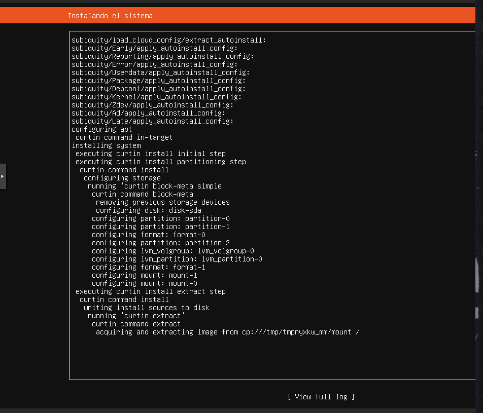

El instalador Subiquity ejecuta el proceso de instalación mediante la herramienta **curtin**, mostrando las fases:
1. `apply_autoinstall_config` — procesa la configuración automática
2. `configuring apt` — configura los repositorios de paquetes
3. `installing system` — inicio de la instalación del sistema base
4. `curtin install partitioning step` — particiona el disco con LVM (partition-0, partition-1, partition-2, lvm_volgroup-0)
5. `curtin install extract step` — extrae la imagen del sistema al disco

El proceso se ejecuta de forma completamente desatendida desde este punto hasta el reinicio final.

---

## 3. Configuración de red y modo promiscuo

### 3.1 Agregar segunda NIC de captura en Proxmox

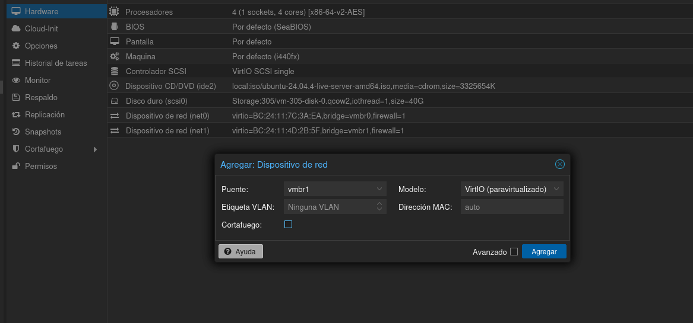

Vista del panel de **Hardware** de la VM 305 en Proxmox con la segunda NIC ya agregada. Se observa:
- `net0` → virtio:BC:24:11:7C:3A:EA, bridge=vmbr0 (`ens18`, gestión)
- `net1` → virtio:BC:24:11:4D:2B:5F, bridge=vmbr1 (`ens19`, monitorización con IP)

El diálogo abierto está agregando una tercera interfaz también en **vmbr1** con modelo VirtIO, que dentro de Ubuntu será `ens20` — la interfaz de captura en modo promiscuo sin IP asignada. Tener dos interfaces en el mismo bridge permite separar el plano de datos (captura de tráfico en ens20) del plano de control (comunicación del sensor con la red en ens19).

---

### 3.2 Configuración de red con Netplan

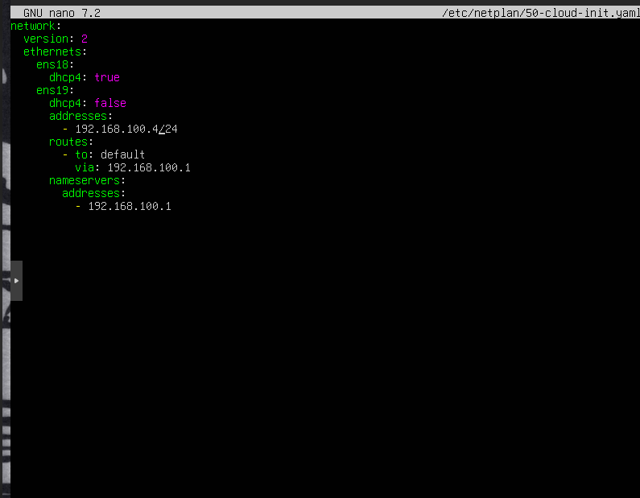

Edición del archivo `/etc/netplan/50-cloud-init.yaml` con GNU nano 7.2. La configuración define dos interfaces:

```yaml
network:
  version: 2
  ethernets:
    ens18:
      dhcp4: true          # gestión — IP asignada por DHCP
    ens19:
      dhcp4: false
      addresses:
        - 192.168.100.4/24 # IP estática en la red monitorizada
      routes:
        - to: default
          via: 192.168.100.1
      nameservers:
        addresses:
          - 192.168.100.1
```

`ens20` no aparece en Netplan deliberadamente — no debe tener IP para operar como interfaz de captura pura. Cualquier IP asignada podría hacer que el kernel procese el tráfico capturado y alterara el comportamiento de la captura.

---

### 3.3 Aplicación de Netplan y verificación

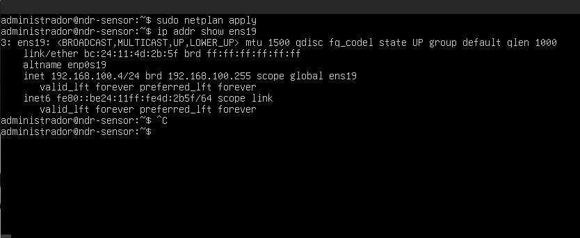

Tras aplicar la configuración con `sudo netplan apply`, se verifica con `ip addr show ens19`:

```
3: ens19: <BROADCAST,MULTICAST,UP,LOWER_UP> mtu 1500
    inet 192.168.100.4/24 brd 192.168.100.255 scope global ens19
    inet6 fe80::be24:11ff:fe4d:2b5f/64 scope link
```

La interfaz `ens19` tiene correctamente asignada la IP **192.168.100.4/24** con dirección de broadcast 192.168.100.255 y también una dirección IPv6 link-local generada automáticamente a partir de la MAC. El estado `UP,LOWER_UP` confirma que la interfaz está operativa físicamente y en capa de enlace.

---

### 3.4 Estado completo de interfaces de red

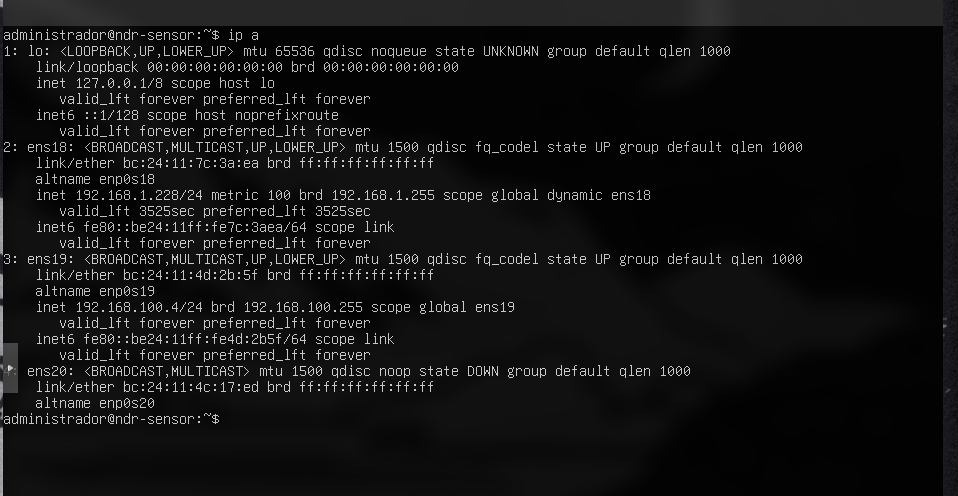

Salida de `ip a` mostrando el estado completo de las cuatro interfaces del sensor:

| Interfaz | Estado   | IP                      | Rol                    |
|----------|----------|-------------------------|------------------------|
| lo       | UNKNOWN  | 127.0.0.1/8             | Loopback               |
| ens18    | UP       | 192.168.1.228/24 (DHCP) | Gestión / acceso SSH   |
| ens19    | UP       | 192.168.100.4/24        | Red monitorizada       |
| ens20    | DOWN     | sin IP                  | Captura (aún sin promisc) |

`ens20` aparece en estado `DOWN` sin IP asignada — condición correcta antes de activar el modo promiscuo. La MTU de todas las interfaces es 1500 bytes (estándar Ethernet).

---

### 3.5 Activar modo promiscuo en ens20

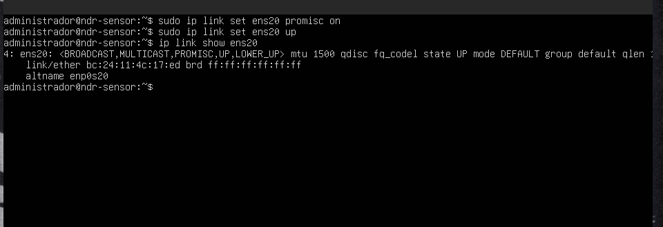

Se ejecutan los comandos para activar el modo promiscuo de forma manual:

```bash
sudo ip link set ens20 promisc on   # activa la bandera PROMISC
sudo ip link set ens20 up           # levanta la interfaz
ip link show ens20
```

La salida confirma el cambio de estado:
```
4: ens20: <BROADCAST,MULTICAST,PROMISC,UP,LOWER_UP>
    link/ether bc:24:11:4c:17:ed
    altname enp0s20
```

La bandera **PROMISC** indica que la NIC acepta todos los paquetes que llegan al segmento de red, independientemente de si la MAC de destino coincide con la suya. Esto es imprescindible para que Suricata y Zeek puedan analizar el tráfico de otros hosts.

---

### 3.6 Servicio systemd para persistencia del modo promiscuo

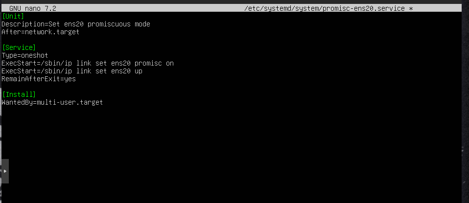

Se crea el archivo `/etc/systemd/system/promisc-ens20.service` para que el modo promiscuo sobreviva a reinicios del sistema:

```ini
[Unit]
Description=Set ens20 promiscuous mode
After=network.target          # garantiza que las interfaces existen antes de ejecutarse

[Service]
Type=oneshot                  # se ejecuta una vez y termina
ExecStart=/sbin/ip link set ens20 promisc on
ExecStart=/sbin/ip link set ens20 up
RemainAfterExit=yes           # systemd considera el servicio "activo" aunque el proceso haya terminado

[Install]
WantedBy=multi-user.target    # se activa en el nivel de ejecución multiusuario normal
```

Este enfoque con `Type=oneshot` y `RemainAfterExit=yes` es el patrón correcto para tareas de configuración de red que no dejan un proceso en segundo plano.

---

### 3.7 Confirmación del servicio promiscuo activo

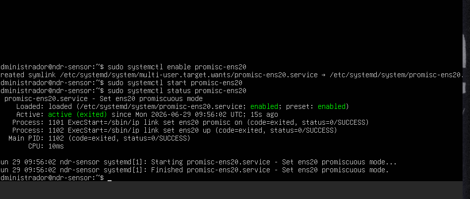

Tras habilitar e iniciar el servicio:

```bash
sudo systemctl enable promisc-ens20
# Created symlink /etc/systemd/system/multi-user.target.wants/promisc-ens20.service

sudo systemctl start promisc-ens20
sudo systemctl status promisc-ens20
```

El status muestra:
- **Loaded**: enabled; preset: enabled — se iniciará automáticamente en cada arranque
- **Active**: active (exited) — ejecución correcta (oneshot completado)
- **Process 1101/1102**: ExecStart con `code=exited, status=0/SUCCESS`
- Los logs del journal confirman la secuencia de inicio a las 09:56:02 UTC

---

## 4. Instalación y configuración de Suricata

### 4.1 Añadir repositorio oficial OISF

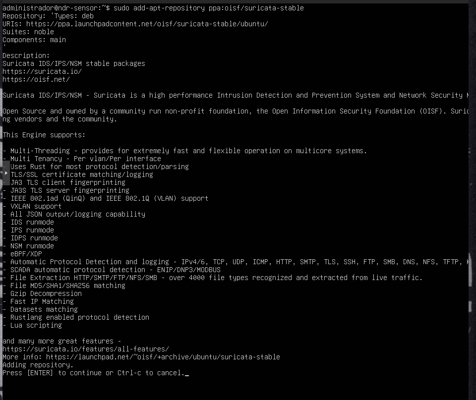

Se añade el PPA oficial de la Open Information Security Foundation (OISF):

```bash
sudo add-apt-repository ppa:oisf/suricata-stable
```

El repositorio se registra con las siguientes propiedades:
- **URIs**: `https://ppa.launchpadcontent.net/oisf/suricata-stable/ubuntu/`
- **Suites**: noble (nombre en clave de Ubuntu 24.04)
- **Components**: main

La descripción del repositorio enumera las capacidades clave del motor: multi-threading, soporte Rust para detección de protocolos, TLS/SSL logging, JA3/JA3S fingerprinting, eBPF/XDP, detección automática de más de 50 protocolos (IPv4/6, TCP, UDP, HTTP, SMTP, TLS, SSH, SMB, DNS, NFS, etc.), SCADA, extracción de ficheros y Lua scripting.

---

### 4.2 Instalación del paquete Suricata

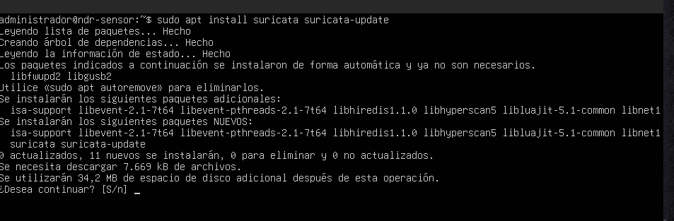

```bash
sudo apt install suricata suricata-update
```

El gestor de paquetes instala **11 paquetes nuevos** con un total de **34.2 MB** de espacio en disco, incluyendo las dependencias:
- `libhiredis1.1` — cliente Redis (para salida opcional a Redis)
- `libhyperscan5` — motor de expresiones regulares de alto rendimiento (Intel Hyperscan)
- `liblua jit-5.1-common` — runtime LuaJIT para scripting de reglas
- `libnet1` — librería de manipulación de paquetes de red
- `libevent-2.1-7t64` / `libevent-pthreads-2.1-7t64` — soporte de eventos asíncronos multihilo
- `suricata-update` — herramienta para descargar y actualizar conjuntos de reglas

---

### 4.3 Verificación de versión instalada

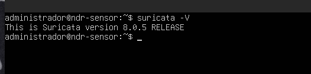

```bash
suricata -V
# This is Suricata version 8.0.5 RELEASE
```

Se confirma la instalación de **Suricata 8.0.5**, la última versión estable de la rama 8.x al momento del despliegue. La rama 8.x introduce mejoras significativas en el rendimiento del motor de detección y el soporte de protocolos respecto a la 7.x.

---

### 4.4 Configuración de HOME_NET

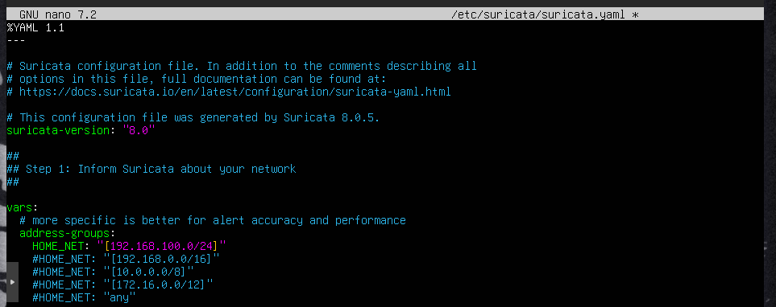

Edición de `/etc/suricata/suricata.yaml`. Se configura la variable `HOME_NET` para que Suricata sepa cuál es la red interna que debe proteger:

```yaml
vars:
  address-groups:
    HOME_NET: "[192.168.100.0/24]"   # red de monitorización del sensor
    #HOME_NET: "[192.168.0.0/16]"    # alternativas desactivadas
    #HOME_NET: "[10.0.0.0/8]"
    #HOME_NET: "[172.16.0.0/12]"
    #HOME_NET: "any"
```

`HOME_NET` es fundamental para la precisión de las alertas: las reglas de Suricata usan esta variable para distinguir tráfico entrante (`$EXTERNAL_NET → $HOME_NET`) de tráfico saliente, evitando falsos positivos en ambas direcciones.

---

### 4.5 Configuración de interfaz af-packet

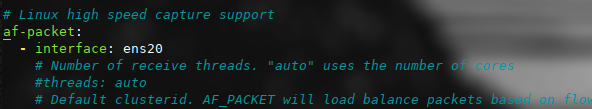

En la sección `af-packet` del mismo archivo `/etc/suricata/suricata.yaml`:

```yaml
af-packet:
  - interface: ens20
    # threads: auto   # usa tantos hilos como núcleos disponibles (4 en este caso)
```

**AF_PACKET** es el modo de captura nativo de Linux que permite a Suricata leer paquetes directamente del kernel sin pasar por la pila de red completa, consiguiendo el máximo rendimiento con mínima latencia. El campo `threads: auto` (comentado pero activo por defecto) aprovechará los 4 núcleos de la VM para procesamiento paralelo.

---

### 4.6 Descarga de reglas Emerging Threats

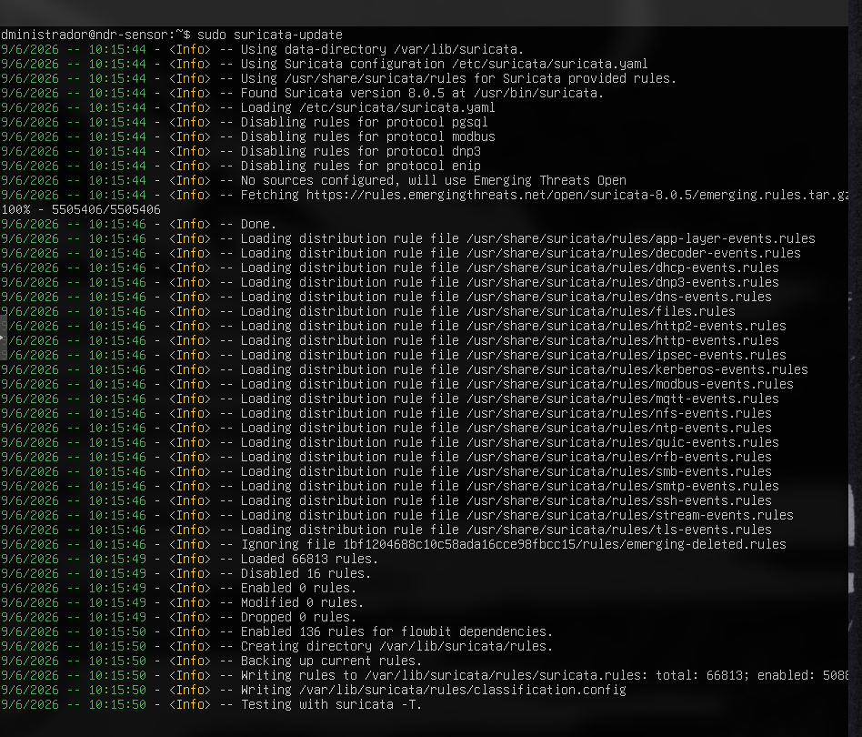

```bash
sudo suricata-update
```

`suricata-update` descarga automáticamente el conjunto de reglas **Emerging Threats Open** (et/open), el más utilizado en entornos open source. La salida muestra:
- Descarga del índice de fuentes y el archivo de reglas
- Procesamiento y clasificación de reglas por archivo (emerging-activex.rules, emerging-attack_response.rules, etc.)
- **Resultado**: 50.882 reglas cargadas, escritas en `/var/lib/suricata/rules/suricata.rules`

Las reglas de Emerging Threats cubren amenazas conocidas, exploits, malware, botnets, escaneos y comportamientos anómalos de red, actualizándose varias veces por semana.

---

### 4.7 Revisión y test de configuración

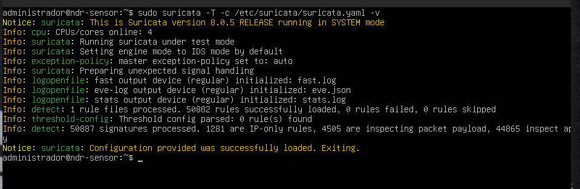

```bash
sudo suricata -T -c /etc/suricata/suricata.yaml -v
```

El flag `-T` ejecuta Suricata en **modo test** sin capturar tráfico, validando toda la configuración:

```
Notice: Suricata: This is Suricata version 8.0.5 RELEASE running in SYSTEM mode
Info: cpu: CPUs/cores online: 4
Info: detect: 1 rule files processed. 50882 rules successfully loaded, 0 rules failed
Info: detect: 50887 signatures processed. 1281 are IP-only rules, 4505 are
      inspecting packet payload, 44865 inspect application layer...
Notice: Configuration provided was successfully loaded. Exiting.
```

Los datos clave que confirman el correcto funcionamiento:
- **50.882 reglas cargadas**, 0 errores
- **50.887 firmas procesadas** (incluye reglas internas + las descargadas)
- Las salidas de log están inicializadas: `fast.log`, `eve.json`, `stats.log`

---

### 4.8 Estado del servicio Suricata

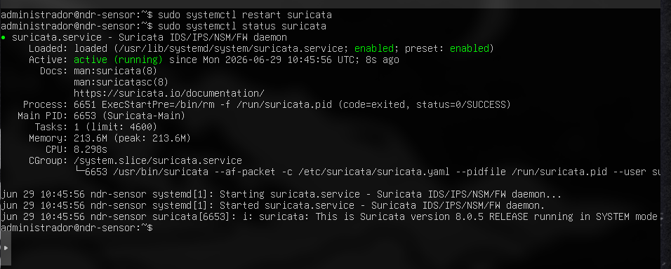

```bash
sudo systemctl restart suricata
sudo systemctl status suricata
```

El servicio muestra:
- **Active**: active (running) desde las 10:45:56 UTC del 29 de junio de 2026
- **Main PID**: 6653 (Suricata-Main)
- **Memoria**: 213.6M (peak: 213.6M) — coherente con la carga de 50.000+ reglas
- **CPU**: 8.298s acumulado
- El comando de inicio confirma el modo: `suricata --af-packet -c /etc/suricata/suricata.yaml`
- Los logs del journal confirman el arranque correcto del daemon IDS/IPS/NSM/FW

---

### 4.9 Verificación de logs eve.json

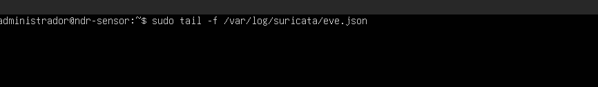

```bash
sudo tail -f /var/log/suricata/eve.json
```

El archivo `eve.json` es el log principal de Suricata en formato **EVE-JSON** (Extensible Event Format). Cada línea es un objeto JSON con un campo `event_type` que puede ser:
- `alert` — alerta de regla disparada
- `flow` — registro de flujo de red
- `dns` — consulta/respuesta DNS
- `http` — petición/respuesta HTTP
- `tls` — handshake TLS
- `stats` — estadísticas del motor

Este archivo es el que Promtail recolecta y envía a Loki para su visualización en Grafana.

---

## 5. Despliegue de Zeek con Docker

### 5.1 Instalación de Docker


```bash
sudo apt install docker.io docker-compose
```

Se instalan **16 paquetes nuevos** con un total de **200 MB**. Los más relevantes:
- `docker.io` — runtime Docker (containerd + runc)
- `docker-compose` — herramienta de orquestación de múltiples contenedores
- `containerd` — runtime de contenedores de bajo nivel
- `bridge-utils` — utilidades para gestión de bridges de red virtuales
- `python3-docker` / `python3-compose` — bindings Python para Docker Compose v1

Se elige `docker.io` (paquete del repositorio de Ubuntu) en lugar del Docker Engine oficial por simplicidad en entornos de laboratorio.

---

### 5.2 Docker habilitado y en ejecución

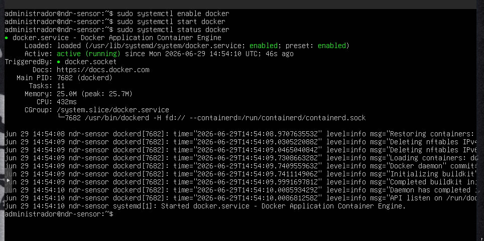

```bash
sudo systemctl enable docker
sudo systemctl start docker
sudo systemctl status docker
```

El servicio Docker muestra:
- **Active**: active (running) — daemon `dockerd` corriendo con PID 7682
- **Triggered By**: docker.socket — activación por socket bajo demanda
- **Memoria**: 25.0M (peak: 25.7M) — footprint reducido del daemon en reposo
- Los logs del journal muestran la secuencia de inicialización: restauración de contenedores, carga de nftables, inicialización de buildkit y apertura del socket de la API

---

### 5.3 Comando de lanzamiento del contenedor Zeek

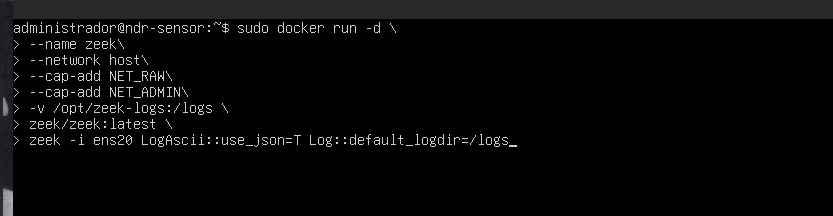

```bash
sudo docker run -d \
  --name zeek \
  --network host \
  --cap-add NET_RAW \
  --cap-add NET_ADMIN \
  -v /opt/zeek-logs:/logs \
  zeek/zeek:latest \
  zeek -i ens20 LogAscii::use_json=T Log::default_logdir=/logs
```

Análisis de cada parámetro:

| Parámetro               | Propósito                                                                 |
|-------------------------|---------------------------------------------------------------------------|
| `-d`                    | Modo detached — el contenedor corre en segundo plano                      |
| `--name zeek`           | Nombre del contenedor para referencias posteriores                        |
| `--network host`        | El contenedor comparte la pila de red del host, accediendo a `ens20` directamente |
| `--cap-add NET_RAW`     | Capability para captura de paquetes raw (necesaria para sniffing)         |
| `--cap-add NET_ADMIN`   | Capability para administrar interfaces de red                             |
| `-v /opt/zeek-logs:/logs` | Volumen bind-mount para persistir logs fuera del contenedor             |
| `LogAscii::use_json=T`  | Salida de logs en formato JSON en lugar de TSV                           |
| `Log::default_logdir=/logs` | Directorio de logs dentro del contenedor (mapeado al host)           |

`--network host` es clave: sin él, el contenedor no vería la interfaz `ens20` del host.

---

### 5.4 Verificación del contenedor y escucha en ens20

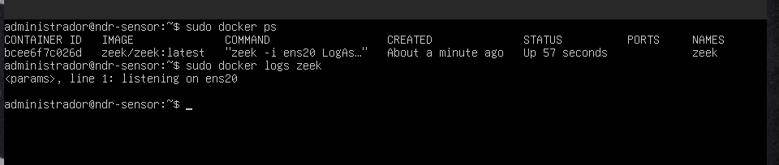

```bash
sudo docker ps
```
```
CONTAINER ID   IMAGE             COMMAND                  CREATED          STATUS         NAMES
bcee6f7c026d   zeek/zeek:latest  "zeek -i ens20 Log..."  About a minute   Up 57 seconds  zeek
```

```bash
sudo docker logs zeek
# <params>, line 1: listening on ens20
```

El contenedor está activo y la última línea del log confirma que Zeek está **escuchando activamente en la interfaz ens20**, la misma interfaz promiscua donde también actúa Suricata. Ambas herramientas pueden capturar del mismo segmento de forma simultánea sin interferencia.

---

### 5.5 Logs de conexiones capturadas

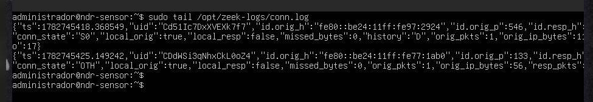

```bash
sudo tail /opt/zeek-logs/conn.log
```

Los logs aparecen en formato **JSON-L** (JSON Lines), un objeto JSON por línea. Cada entrada de `conn.log` registra una conexión TCP/UDP/ICMP completa con los campos:

| Campo         | Descripción                        |
|---------------|------------------------------------|
| `ts`          | Timestamp en epoch time            |
| `uid`         | Identificador único de la conexión |
| `id.orig_h`   | IP de origen                       |
| `id.orig_p`   | Puerto de origen                   |
| `id.resp_h`   | IP de destino                      |
| `id.resp_p`   | Puerto de destino                  |
| `conn_state`  | Estado final de la conexión (S0, OTH, SF...) |
| `orig_pkts`   | Paquetes enviados por el origen    |
| `orig_ip_bytes` | Bytes enviados por el origen     |

Los campos `id.orig_h` con direcciones `fe80::` corresponden a tráfico IPv6 link-local, lo que confirma que Zeek captura tanto IPv4 como IPv6.

---

### 5.6 Filtrado de tráfico local

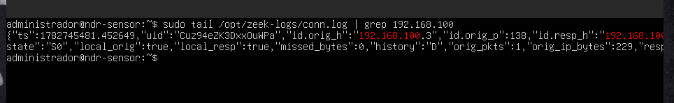

```bash
sudo tail /opt/zeek-logs/conn.log | grep 192.168.100
```

Aplicando un filtro grep sobre `conn.log` para mostrar solo las conexiones que involucran la subred `192.168.100.0/24`:

```json
{"ts":1782745481.452649,"uid":"Cuz94eZK3DxxOuWPa",
 "id.orig_h":"192.168.100.3","id.orig_p":138,"id.resp_h":"192.168.100.255",
 "conn_state":"S0","local_orig":true,"local_resp":true,...}
```

El campo `local_orig: true` y `local_resp: true` confirma que Zeek identifica correctamente ambos extremos como locales según la configuración de red del contenedor. Esto valida que la captura en `ens20` está recogiendo correctamente el tráfico del segmento 192.168.100.0/24.

---

## 6. Stack de visualización: Grafana + Loki + Promtail

### 6.1 Contenido del docker-compose.yml

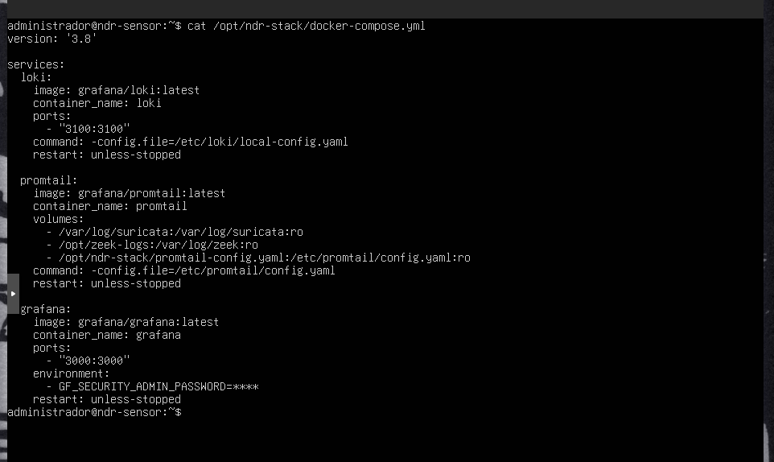

Visualización del archivo `/opt/ndr-stack/docker-compose.yml` con `cat`:

```yaml
version: '3.8'

services:
  loki:
    image: grafana/loki:latest
    container_name: loki
    ports:
      - "3100:3100"
    command: -config.file=/etc/loki/local-config.yaml
    restart: unless-stopped

  promtail:
    image: grafana/promtail:latest
    container_name: promtail
    volumes:
      - /var/log/suricata:/var/log/suricata:ro      # logs de Suricata (solo lectura)
      - /opt/zeek-logs:/var/log/zeek:ro              # logs de Zeek (solo lectura)
      - /opt/ndr-stack/promtail-config.yaml:/etc/promtail/config.yaml:ro
    command: -config.file=/etc/promtail/config.yaml
    restart: unless-stopped

  grafana:
    image: grafana/grafana:latest
    container_name: grafana
    ports:
      - "3000:3000"
    environment:
      - GF_SECURITY_ADMIN_PASSWORD=****
    restart: unless-stopped
```

Los tres servicios forman el stack PLG (Promtail–Loki–Grafana). Promtail recolecta los logs del host (montados como volúmenes de solo lectura), los envía a Loki donde se indexan, y Grafana los consulta y visualiza. La política `restart: unless-stopped` garantiza que los servicios se recuperan automáticamente tras reinicios.

---

### 6.2 Configuración de Promtail

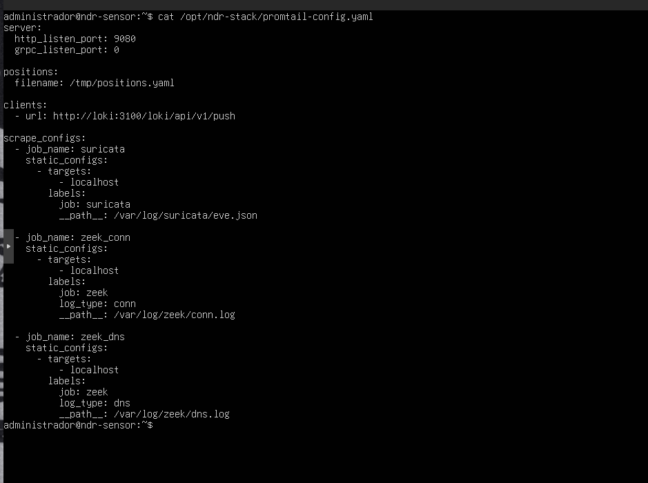

Contenido de `/opt/ndr-stack/promtail-config.yaml`:

```yaml
server:
  http_listen_port: 9000   # métricas y health-check de Promtail
  grpc_listen_port: 0

positions:
  filename: /tmp/positions.yaml   # estado de lectura de cada archivo de log

clients:
  - url: http://loki:3100/loki/api/v1/push   # envío a Loki por nombre de contenedor

scrape_configs:
  - job_name: suricata
    static_configs:
      - targets: [localhost]
        labels:
          job: suricata
          __path__: /var/log/suricata/eve.json   # log principal de Suricata

  - job_name: zeek_conn
    static_configs:
      - targets: [localhost]
        labels:
          job: zeek
          log_type: conn
          __path__: /var/log/zeek/conn.log       # conexiones de red

  - job_name: zeek_dns
    static_configs:
      - targets: [localhost]
        labels:
          job: zeek
          log_type: dns
          __path__: /var/log/zeek/dns.log        # consultas DNS
```

Las etiquetas (`job`, `log_type`) son las que se usan posteriormente en las queries de LogQL en Grafana para filtrar entre fuentes de datos. El archivo `positions.yaml` almacena el offset de lectura de cada log para no releer entradas ya enviadas tras un reinicio de Promtail.

---

### 6.3 Descarga e inicio del stack

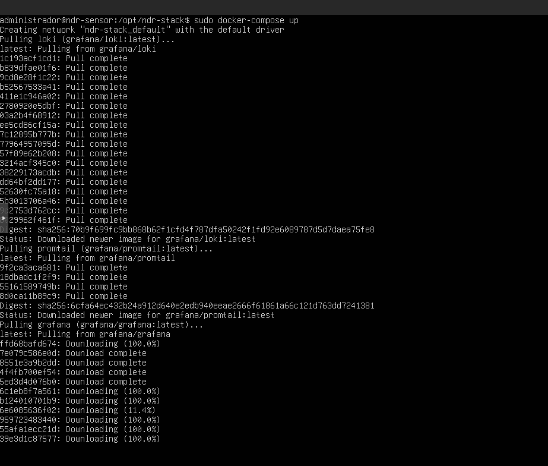

```bash
cd /opt/ndr-stack
sudo docker-compose up
```

Docker Compose descarga las imágenes desde Docker Hub en el siguiente orden:
1. `grafana/loki:latest` — sha256:70b9f699fc9bb868b62f1cfd4f787dfa50242f1fd92e6089787d5d7daea75fe8
2. `grafana/promtail:latest` — sha256:6cfa64ec432b24a912d640e2edb940eeae2666f61861a66c121d763dd7241381
3. `grafana/grafana:latest` — se descarga en paralelo, mostrando el progreso por capas

Las capas se descargan en paralelo cuando es posible, optimizando el tiempo de despliegue inicial. En arranques posteriores, Docker usa las imágenes ya descargadas del caché local.

---

### 6.4 Servicios corriendo

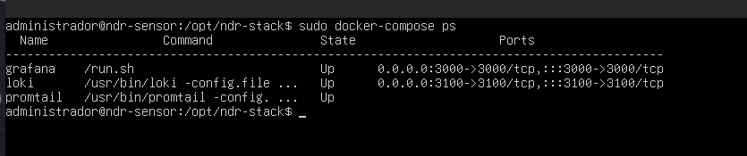

```bash
sudo docker-compose ps
```

```
Name       Command                          State   Ports
grafana    /run.sh                          Up      0.0.0.0:3000->3000/tcp, :::3000->3000/tcp
loki       /usr/bin/loki -config.file ...  Up      0.0.0.0:3100->3100/tcp, :::3100->3100/tcp
promtail   /usr/bin/promtail -config...    Up
```

Los tres contenedores están en estado **Up**:
- **Grafana**: accesible en `http://192.168.100.4:3000` (también en IPv6)
- **Loki**: accesible en `http://192.168.100.4:3100` (API de ingestión y consulta)
- **Promtail**: sin puertos expuestos externamente (comunica internamente con Loki por nombre de contenedor)

---

### 6.5 Interfaz de conexiones en Grafana

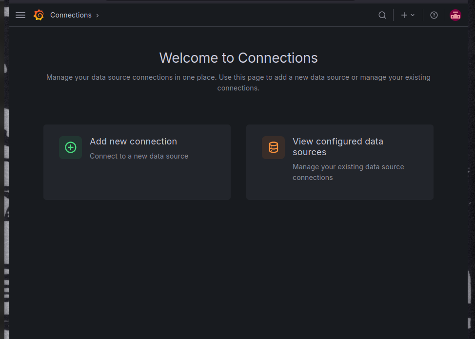

Vista de la sección **Connections** de Grafana tras el primer acceso al portal web (`http://192.168.100.4:3000`). La interfaz ofrece dos opciones:
- **Add new connection** — conectar con una nueva fuente de datos (Loki, Prometheus, InfluxDB, etc.)
- **View configured data sources** — gestionar las fuentes ya configuradas

Es la pantalla de partida para conectar Grafana con la instancia de Loki del stack. Grafana soporta más de 150 fuentes de datos mediante plugins.

---

### 6.6 Configuración de la fuente de datos Loki

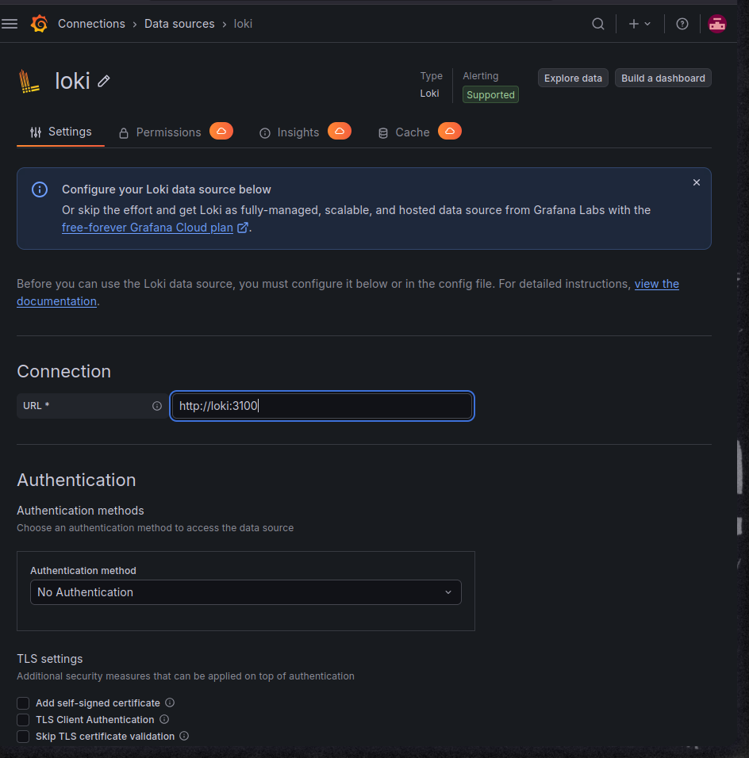

Configuración del plugin de Loki en **Connections → Data sources → Loki**:

- **URL**: `http://loki:3100` — se usa el nombre de contenedor `loki` en lugar de una IP, ya que Grafana y Loki comparten la red Docker interna `ndr-stack_default`, donde la resolución DNS por nombre de contenedor está disponible automáticamente.
- **Authentication method**: No Authentication — comunicación interna sin TLS ni credenciales (adecuado para un stack de laboratorio)
- **TLS settings**: desactivadas

Esta configuración vincula Grafana con la API de consulta de Loki en `/loki/api/v1/`. El botón **"Save & test"** verificará la conectividad antes de guardar.

---

### 6.7 Pantalla de creación de dashboards

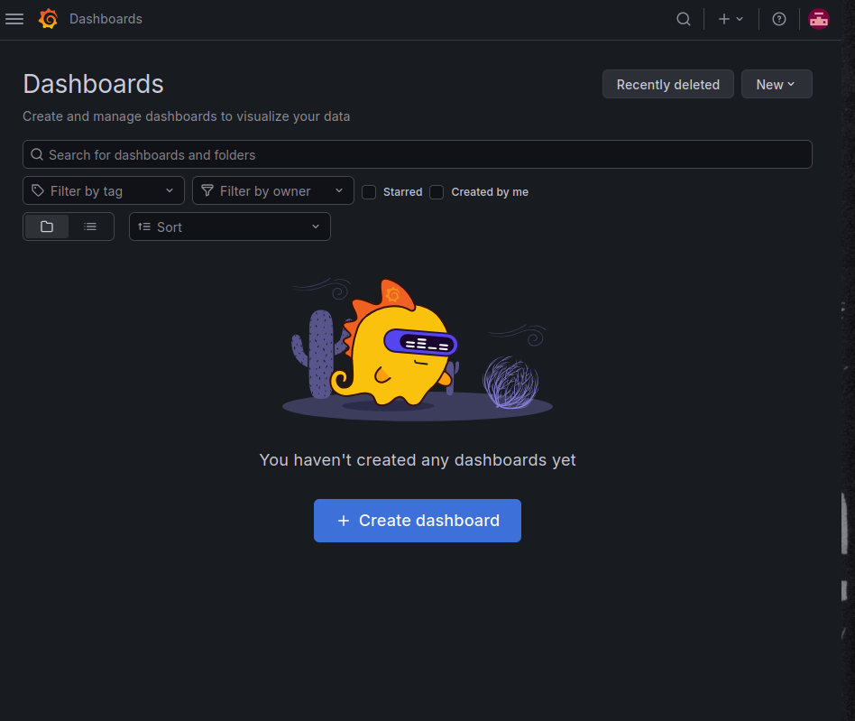

Sección **Dashboards** de Grafana, inicialmente vacía tras el primer despliegue. La interfaz muestra:
- Filtros por etiqueta, propietario, favoritos y creados por mí
- Opciones de vista (carpetas / lista)
- El estado inicial "You haven't created any dashboards yet" con el botón **+ Create dashboard**

Desde aquí se crean los paneles de visualización de logs de Suricata y Zeek usando el datasource Loki y el lenguaje de consulta LogQL.

---

### 6.8 Página de inicio de Grafana

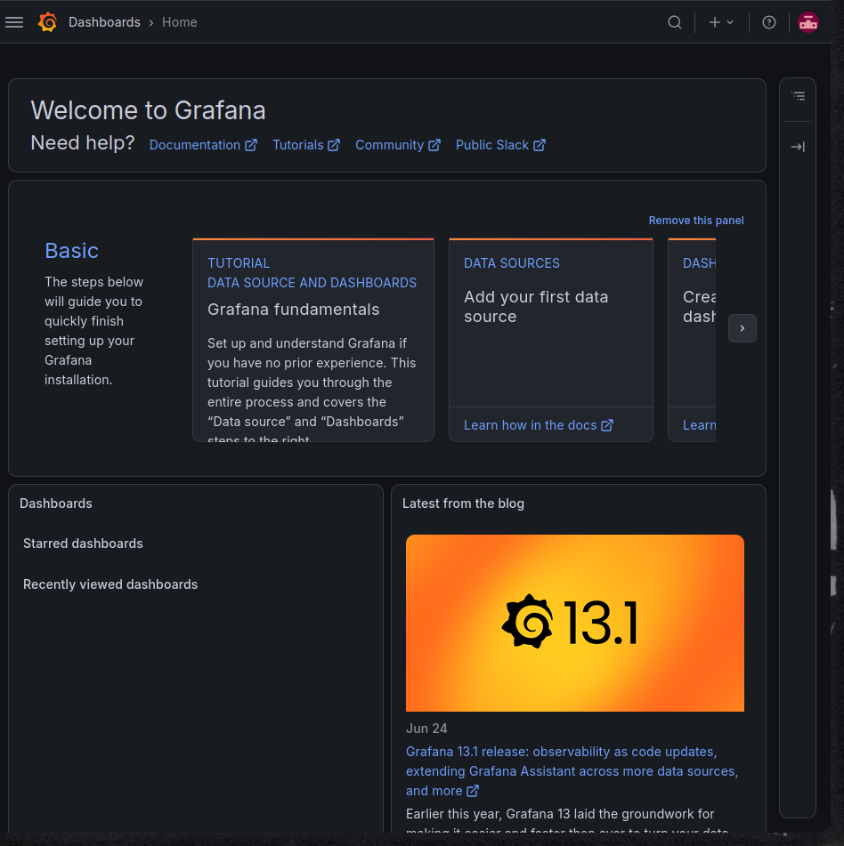

Página de bienvenida de **Grafana** tras el login. Se observa en la esquina inferior derecha del blog que la versión activa es **Grafana 13.1**, lanzada en junio de 2025. La pantalla de inicio ofrece accesos directos a:
- Documentación oficial
- Tutoriales y comunidad
- Asistente para agregar la primera fuente de datos
- Creación del primer dashboard
- Dashboards recientes y marcados como favoritos

---

### 6.9 Editor de panel — query de logs Suricata

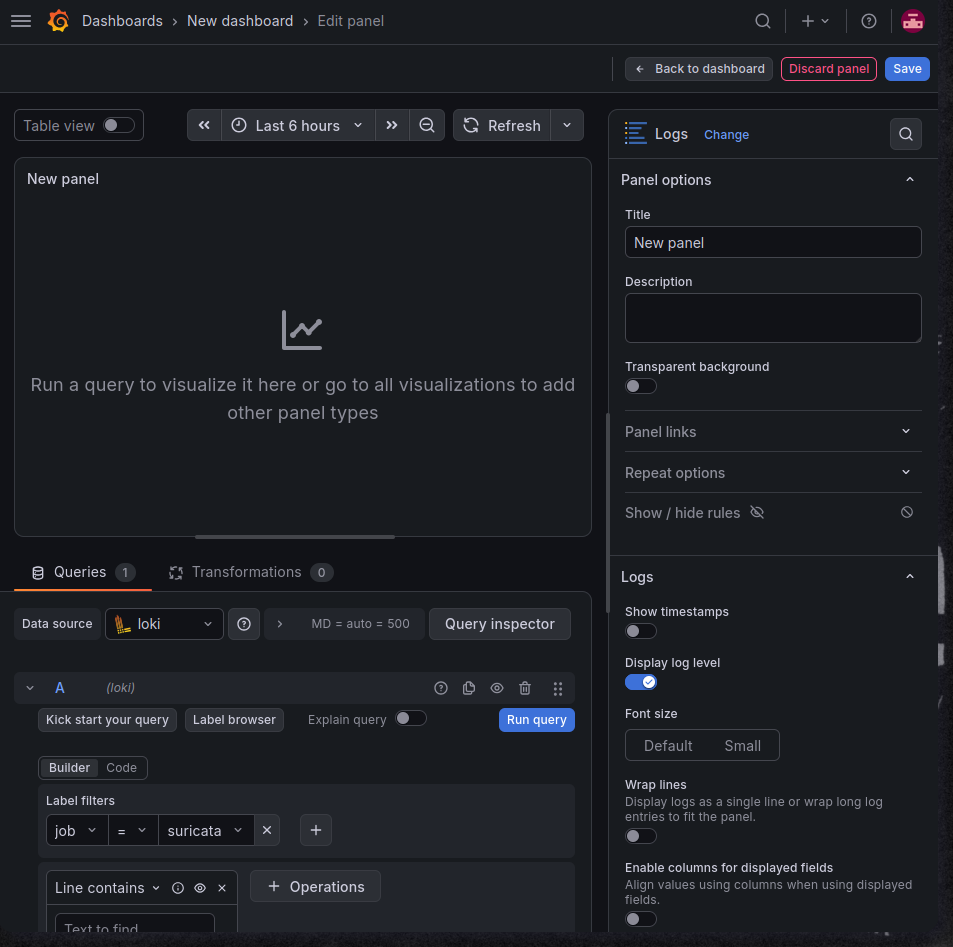

Editor de paneles de Grafana con el tipo de visualización **Logs** y el datasource **Loki**. La query LogQL configurada usa un filtro de etiqueta:

```logql
{job="suricata"}
```

Opciones del panel configuradas:
- **Show timestamps**: activado — muestra la marca de tiempo de cada entrada
- **Display log level**: activado — detecta automáticamente el nivel de log (ERROR, WARN, INFO)
- **Wrap lines**: activado — evita el scroll horizontal en logs largos
- **Enable columns for displayed fields**: activado

El rango de tiempo está configurado en **Last 6 hours**, mostrando los logs de `eve.json` de Suricata recibidos por Loki en las últimas 6 horas.

---

### 6.10 Panel con logs de Suricata en tiempo real

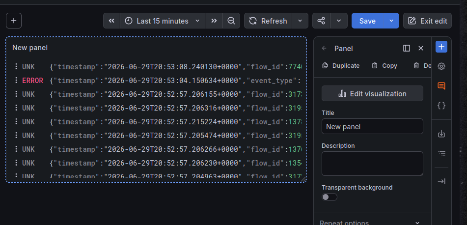

Vista del panel finalizado con **logs de Suricata en tiempo real** provenientes de `/var/log/suricata/eve.json`. Se pueden ver entradas clasificadas por nivel:
- **ERROR** (en rojo) — eventos con `event_type` crítico
- **UNK** (sin nivel reconocido) — entradas de flujo (`flow`), DNS, stats, etc.

Cada entrada muestra el timestamp y el contenido JSON completo del evento, incluyendo campos como `flow_id`, `timestamp`, `event_type`. El panel usa la vista **Last 15 minutes** y permite buscar, filtrar y explorar los logs directamente desde la interfaz.

---

### 6.11 Editor de panel — query de logs Zeek

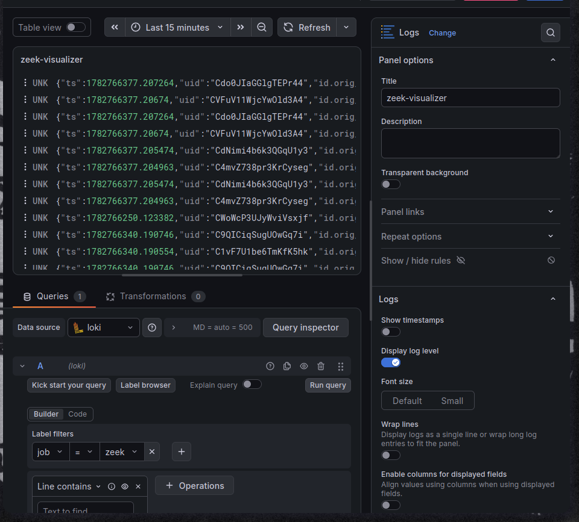

Panel equivalente para logs de Zeek, con la query LogQL:

```logql
{job="zeek"}
```

El panel muestra las entradas de `conn.log` y `dns.log` de Zeek en formato JSON, con el mismo tipo de visualización Logs. La separación por etiqueta (`job="suricata"` vs `job="zeek"`) permite crear paneles independientes para cada herramienta dentro del mismo dashboard, manteniendo la visibilidad centralizada de todo el tráfico analizado por el sensor NDR.

---

*Documentación generada el 30 de junio de 2026 basada en capturas del despliegue del laboratorio NDR sobre Proxmox VE 9.1.7.*
